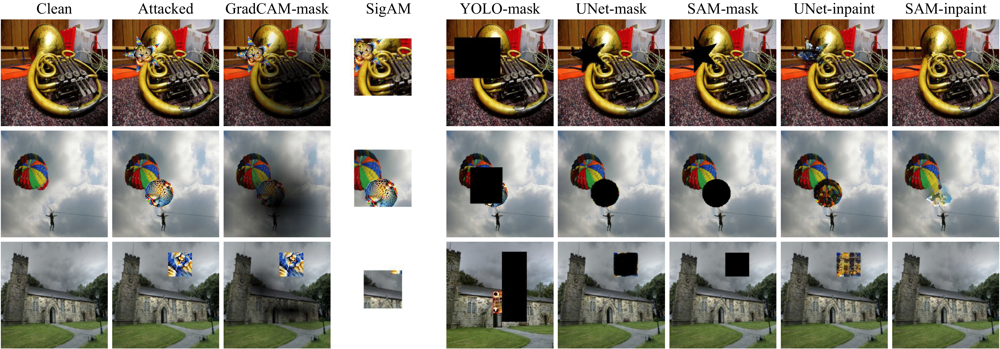
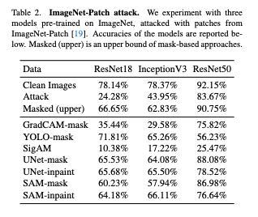

# Defence against Adversarial Patches (DAAP)

This is the code repository for the final project of course CS682 at UMass.

Deep neural networks have gained popularity, but their vulnerability to adversarial attacks is a growing concern.
These attacks involve subtle manipulations to input data, designed to mislead models into incorrect predictions.
Despite high performance, neural networks often have complex, non-linear decision boundaries, which adversarial attacks exploit, causing misclassification.
This can have serious implications in real-world applications like autonomous vehicles, face recognition, or medical systems.

In this project, we tackle defenses against adversarial patches in image classification tasks. We explore methods to counteract patches designed
to fool different models, including square, circle, and star-shaped patches. Our defenses reduce attack effects from up to 67% misclassification down to 13%.
We also analyze the performance, generalization across attacks, and robustness to non-adversarial objects.

## Proposed Defences

We amass a training data by using benchmark attack strategies and attacking images of imagenette dataset with it.
We then train models or use pretrained models to detect the attack patch in an image and segment it. Following are the type of models used
to detect the attacked images.

- Supervised: As the name suggests, training data of attacked images is amassed and a model is trained to detect
patches. We have leveraged the outputs of object detection and semantic segmentation models such as YOLOv5 and
UNet, respectively to localize and mask the patches. The images with masked patches are fed to standard
classification models to test the gain in accuracy after defense against the patch. YOLO-mask and the UNet-mask have been
generated in this manner.
- Pre-trained: These involve no training as the models have already been trained on huge amounts of data.
Segment-Anything (SAM-mask) and LAMA (inpaint) are such models.

Using existing models we detect an adversarial patch and mask them and resend the masked image to the classifier. We also explored inpaining to recover the attacked
image region and attempt to bridge the gap between attacked and clean images.

Additionally we also explored some methods to do it in a unsupervised or weakly supervised manner such as masking the attacked patches using GradCAM.

## Results

### Samples attacked images and different defence examples

### Given below are the classification accuracy recovered after applying our proposed defence strategies.

